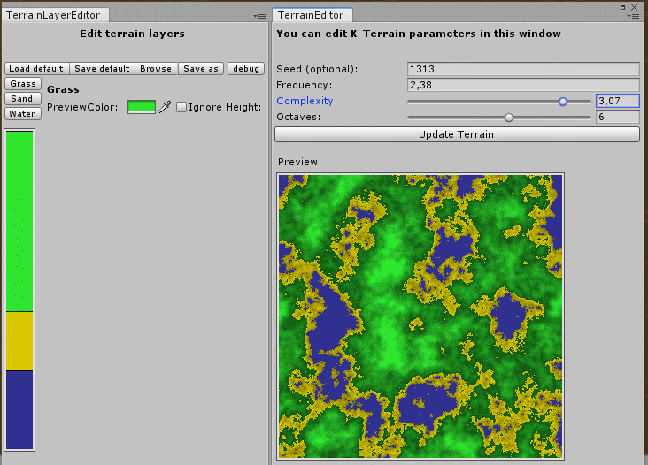
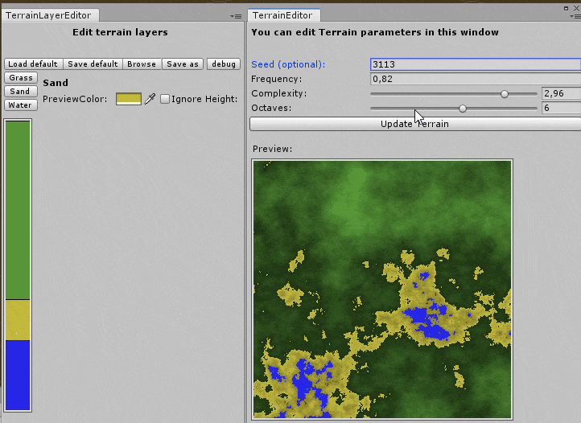
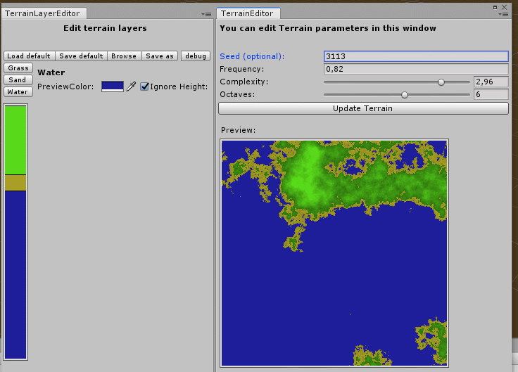

# Unity 2D-Terrain Editor

Used for generating terrainlike 2D-noise. Doesn't output anything right now, but it's a WIP and I am probably going to use it in future projects.

Currently you can change terrain layer and generation parameters. Layer settings can be saved in json format.

Code can be found here: 

***

Changing noise settings

***

Changing layer settings and terrain preview color

***

